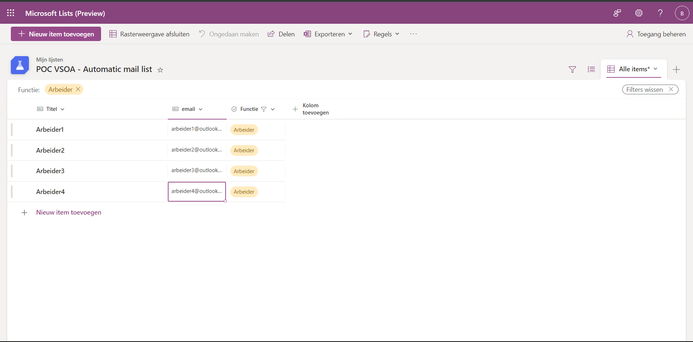

# Analyse Proof of concept VSAO - Automatic mail sending
## Description
Proof of concept to study the posiblity to automatically send mails.
These mails will be constructed through a [template](#mail-template). 
The [template](#mail-template) used for a specific mail will be determined by the function of a person. 

The application will receive an **excel file**. 
This excel file will contain records of <span style=color:green>[people](#people)</span> in a database. 
The database used is **microsoft lists**. 

## <span style=color:green>Data </span>
### <span style=color:green>People</span>
<span style=color:yellow>OPEN Analysis</span> 
A person consists of following datamodel: 

- Titel 
- Email
- Function
### <span style=color:green>Mail template</span>
<span style=color:yellow>OPEN Analysis</span> 
A mail template consists of following data: 
Each mail will have a **document** attached based on the filter that is used. 

example:

```text
attachment: {file}

Beste {name person}, 

In verband met uw ... zenden wij deze mail om u te verwittigen. 

Met vriendelijke groeten, 
Team proof of concept - VSOA

```

## <span style=color:purple>Technologies</span>
### <span style=color:purple>Microsoft lists - DATABASE</span>
**Microsoft lists** is an application where records can be stored contianing various data. 

In the context of our solution **Microsoft lists** has the option to export records to an excel file. 
This excel file will contain records of [people](#people).
The records in the exported .csv file are filtered through the **Microsoft lists** application itself.

example given below:



### <span style=color:purple>Spring boot application</span>
Spring boot is a framework used inside the Java ecosystem.
In our solution we will use following technologies of Spring boot:
- Spring batch
- Java Mail Sender
- Google Develop... for email address sending the mails
- [ ] H2 database (needed for Spring batch)<br>
<span style=color:yellow>OPEN Analysis</span> 
*Because h2 not recommended for live applications*
- [ ] Thymeleaf for mail templating?<br>
<span style=color:yellow>OPEN Analysis</span> 
- [ ] Docker contianer? <br>
<span style=color:yellow>OPEN Analysis</span> 

## <span style=color:red>TODO</span>
- [ ] Research implementation of Java Mail Sender in combination with Spring Batch.
- [ ] Discuss accpetance criteria
- [ ] Discuss necessity frontend